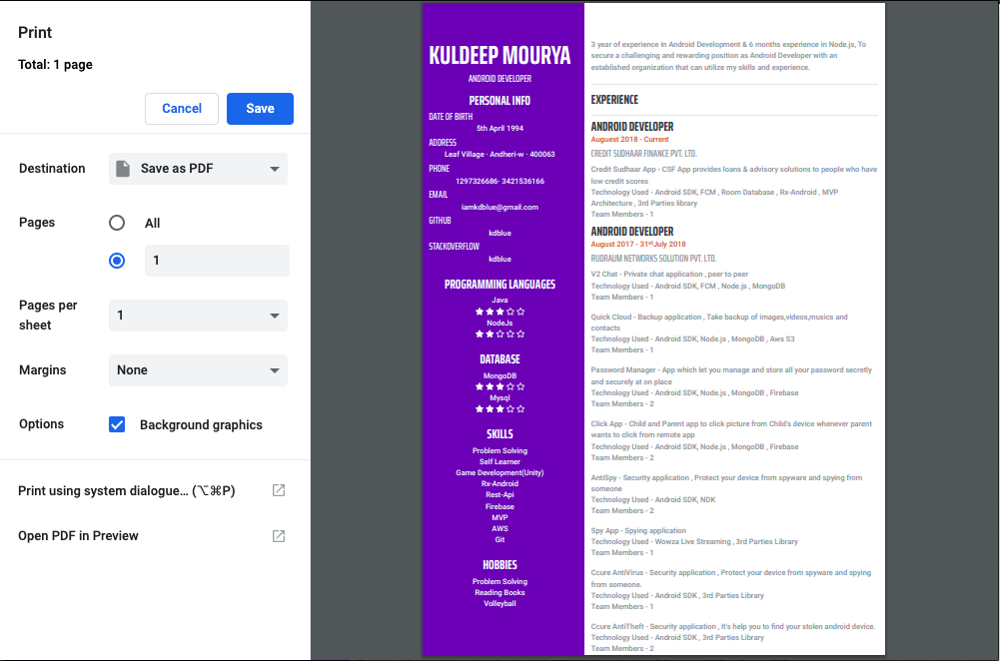

# colored-resume
Colored Resume

**Steps :**
1) Edit firstpage.html its first page of resume
2) open firstpage.html file in crome browser (crome will be best)
3) now for save in pdf , press control + p for print where you can see save as pdf , save it .
4) same apply for secondpage.html
5) now both resume pdf file is ready, lets combine online [Here](https://combinepdf.com/) , after combine download it :)

**Setting pdf format in crome**

**First Page**

**Second Page**

**#Result**

**#First Page Of Resume**

**#Second Page Of Resume**

**Sharing Is Caring**

